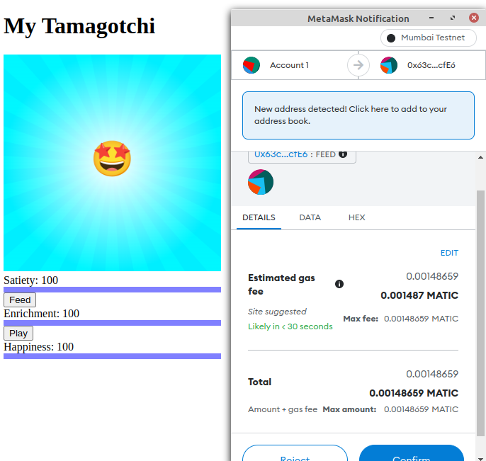

# Full Tamagotchi Game On chain

A Tamagotchi like game on blockchain written in solidity using the Foundry framework for testing.

The Tamagotchi live fully on the blockchain. You have to play with him and feed him to keep him happy and alive.

Tamagotchi contract deploy on mumbai testnet for the polygon blockchain at [0x63c5AC5625C3cF34897CE04dC8b18Ba5b7fbcfE6](https://mumbai.polygonscan.com/address/0x63c5ac5625c3cf34897ce04dc8b18ba5b7fbcfe6)

---
## How to use

- Once the Tamagotchi contract is complete, you can deploy it on a testnet (or mainnet). Use deploy.sh script to deploy to mumbai.
- Then register with [Upkeep](https://keepers.chain.link/) and fund it with LINK.
- Install SvelteKit for the front end `npm init svelte; npm install ethers`
- Run the server locally with `npm run dev -- --open`
- Add the front end code to connect your wallet and fetch the information from the contract on Mumbai
- You can know interact with your Tamagotchi directly from the browser

---

